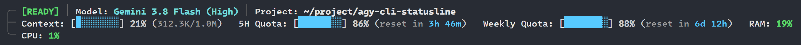

# Antigravity CLI 自訂狀態列 (Custom Statusline)

[English](README.md) | 繁體中文

為 [Antigravity CLI](https://github.com/google/antigravity) (`agy`) 專門打造的高效、模組化且具備自適應排版的命令列狀態列（Statusline / Footer），特別針對 Linux 與 WSL-Ubuntu 環境優化。即時呈現 Agent 運行狀態、AI 模型名稱、Git 分支、脈絡視窗用量、API 額度倒數、系統資源（CPU 與 RAM）及對話產出等指標，全文字標籤清楚易讀，支援自適應動態折行與邊框，完全不造成終端機延遲。



---

## 核心特色

- **極速與超輕量**：採用純 Bash 原生撰寫搭配單次 `jq` 解析，單次執行時間小於 10ms，終端機輸入與游標移動完全無卡頓。
- **雙語系即時切換**：內建多語系字典，支援**繁體中文 (`zh-tw`)** 與 **英文 (`en`)**。
- **直觀文字標籤**：捨棄難以辨識的圖示與字型依賴，所有指標皆有清楚的中文或英文字標，搭配漸層文字進度條（`[██░░]`）。
- **自適應動態行封裝 (Greedy Line-Packing)**：根據終端機寬度自動將指標膠囊排列於盒型邊框行（`╭─`、`├─`、`╰─`）中，在任何視窗大小下皆不會破版或被截斷。
- **即時系統硬體監控**：
  - **CPU 使用率**：透過讀取 `/proc/stat` 時間差計算出真實的即時 CPU 使用率百分比（`%`）。
  - **RAM 記憶體用量**：直接從 `/proc/meminfo` 即時讀取系統記憶體消耗比例。
- **精確 Token 與配額監控**：
  - 脈絡視窗（Context）消耗整數百分比與精確 Token 計數（已消耗 / 上限）。
  - 5 小時 API 配額與每週 API 配額進度條，並包含重置時間倒數。
- **零干擾自動隱藏**：子代理數、背景任務數或產出檔案數為 0 時自動隱藏，維持畫面清爽。
- **高度模組化設定**：透過簡易的 Bash 設定檔（`statusline.conf`）自由增減與排序指標，無需修改腳本程式碼。
- **安全安裝與一鍵還原**：`install.sh` 自動備份並安全更新 `~/.gemini/antigravity-cli/settings.json`，隨時可用 `uninstall.sh` 原樣還原。

---

## 環境需求

- **作業系統**：Linux 或 WSL（Windows 中的 WSL-Ubuntu 22.04）
- **Shell**：`bash`（4.0 以上）
- **JSON 解析工具**：`jq`（若未安裝可執行：`sudo apt install -y jq`）
- **Git**（選用，用於顯示分支與變更狀態）

---

## 安裝方式

進入專案目錄後執行安裝腳本：

```bash
cd agy-cli-statusline

# 開發模式安裝（推薦：建立軟連結，之後修改程式碼即時生效）
./install.sh -s

# 或標準複製安裝
./install.sh
```

安裝腳本會自動執行以下動作：
1. 檢查系統中的 `bash` 與 `jq` 依賴。
2. 部署執行檔至 `~/.antigravity/statusline.sh`。
3. 初始化個人設定檔範本至 `~/.config/antigravity-statusline/statusline.conf`。
4. 安全設定 `~/.gemini/antigravity-cli/settings.json` 中的 `statusLine`（自動建立 `.bak` 備份）。
5. 自動跑一次狀態列預覽以確認渲染正常。

安裝完成後，在 Antigravity CLI 敲擊 Enter 或輸入指令即可立即看見狀態列。

---

## 設定指南

你的個人設定檔路徑為：
```text
~/.config/antigravity-statusline/statusline.conf
```

### 1. 語系切換
切換繁體中文或英文：
```bash
LANGUAGE="zh-tw"    # "zh-tw" 為繁體中文，"en" 為英文
```

### 2. 第一行：核心會話項目
自訂頂部核心項目與顯示順序：
```bash
LINE1_ITEMS=(
  "state"         # Agent 運行狀態 ([就緒]、[思考中]、[處理中]、[工具執行])
  "git"           # Git 分支名稱與變更狀態 (*有變更)
  "model"         # 當前使用中的 AI 模型名稱
  "project"       # 縮短後的專案路徑
  # "conv_id"     # 對話 ID 前 8 碼 (預設關閉，需要可取消註解)
)
```

### 3. 第二行起：動態指標項目
控制要啟用的指標與先後順序（會由貪婪封裝引擎自動折行）：
```bash
BADGE_ITEMS=(
  "context"       # 脈絡視窗進度條與 Token 數量
  "quota_5h"      # 5小時 API 配額進度條與重置倒數
  "quota_weekly"  # 每週 API 配額進度條與重置倒數
  "ram"           # 系統 RAM 記憶體使用百分比
  "cpu"           # 即時 CPU 使用百分比
  "artifacts"     # 對話產出的檔案數量
  "subagents"     # 活躍子代理數量 (為 0 時自動隱藏)
  "bg_tasks"      # 進行中的背景任務 (為 0 時自動隱藏)
)
```

### 4. 樣式與警戒門檻
```bash
SHOW_BOX_BORDER=true        # 是否顯示樹狀盒型邊框 (╭─, ├─, ╰─)
PROGRESS_BAR_STYLE="block"  # 進度條樣式 ("block": [██░░] 或 "ascii": [##--])
SYS_RAM_WARN_PCT=80         # RAM 超過此百分比時顏色轉紅警戒
GIT_MAX_BRANCH_LEN=24       # 分支名稱過長時的截斷長度
PROJECT_MAX_LEN=28          # 專案路徑最大長度
```

---

## 手動測試與參數

你可以直接執行 `statusline.sh` 進行即時預覽或覆寫參數：

```bash
# 使用測試 Payload 預覽狀態列
./statusline.sh --test ./weby-homelab-antigravity-cli-statusline/tests/fixtures/full_payload.json

# 以英文模式預覽
./statusline.sh --test ... --lang en

# 模擬不同終端機寬度排版
./statusline.sh --test ... --cols 80
./statusline.sh --test ... --cols 140

# 檢查版本
./statusline.sh --version
```

### 自動化測試套件
專案內建完整的單元測試（包含雙語輸出、終端機寬度折行、0.25 秒逾時保護等 22 項測試）：

```bash
./tests/run_tests.sh
```

---

## 解除安裝

若要還原 CLI 設定並刪除安裝檔案：

```bash
./uninstall.sh
```

執行後會：
- 從 `~/.gemini/antigravity-cli/settings.json` 中乾淨移除 `statusLine` 區塊並還原。
- 移除 `~/.antigravity/statusline.sh`。
- 保留你的個人設定檔於 `~/.config/antigravity-statusline/statusline.conf`。

---

## 授權條款

MIT License
